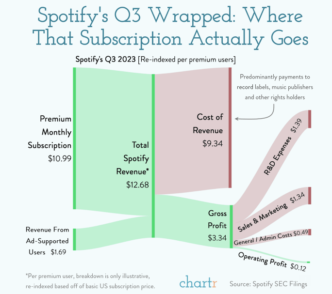

| [home page](README.md) | [Visualizing government Debt](dataviz2) | [critique by design](critique-by-design) | [final project I](final-project-part-one) | [final project II](final-project-part-two) | [final project III](final-project-part-three) |

# Portfolio
This is my public portfolio for Telling Stories with Data at CMU!  Here's where all my cool work will go.  You should probably hire me. 

# About me
Hi! My name is Carlos Schenone, and I am in my last semester of the Management Information Systems (MISM) program. I am passionate about transforming complex data into intuitive and impactful visualizations. My goal is to inspire and assist decision-makers across various organizations by presenting data in a way that is both insightful and accessible.

# What I hope to learn
A few months ago, I subscribed to a newsletter called 'Chartr | Data Storytelling' and began receiving emails featuring beautiful visualizations, like this one:

Then, I discovered this course and didn't hesitate; I decided to enroll to learn the following:

1. how to present complex data in an entertaining and stimulating way.
2. how to build color criteria
3. better understand the use of different digital tools

My aim is to engage my audience effectively, create impact, and also to distinguish myself while building a personal brand.

# Portfolio

## Assignment: [Visualizing government Debt](dataviz2)
This report features three distinct visualizations of government debt-to-GDP ratios, sourced from the OECD database, to analyze trends from 1995 to 2022. The first, a bar chart, illustrates individual country data against the OECD average. The second, a heatmap, displays the spectrum of debt levels over time with color gradations. The third, a line chart, specifically highlights Japan and Greece's rising debt trends, providing a focused narrative on their fiscal trajectories. Each graph utilizes a tailored color scheme to enhance interpretability and emphasize key data points, offering a clear depiction of the debt landscape across selected nations. 

## Assignment 3&4: [Critique by Design](critique-by-design)
Here, I present my critique and design proposal for the Global Passenger Electric Vehicle Market Share visualization from the MakeoverMonday website. I guide you through my thought process during the selection of the data visualization from MakeoverMonday, my critique using Stephen Few's Data Visualization Effectiveness Profile framework, sketching my solution, how I tested it, and how I ultimately built it.

## Final project
My final project examines 'The Renaissance of Chess in the Digital Age,' spotlighting its surge in popularity during the 2020 lockdowns and after 'The Queen's Gambit' aired. The narrative explores the increase in online chess engagement and the rise in Grandmaster numbers, despite the high ELO requirement. It also covers how AI and technological advancements have made chess more accessible, especially aiding young prodigies in reaching top ranks faster. Highlighting chess's cognitive and emotional benefits, my project underscores how anyone can easily start playing this fascinating game.

Source: https://www.pexels.com/photo/white-chess-piece-on-top-of-chess-board-814133/

[Part I](final-project-part-one)
[Part II](final-project-part-two)
[Part III](final-project-part-three)

