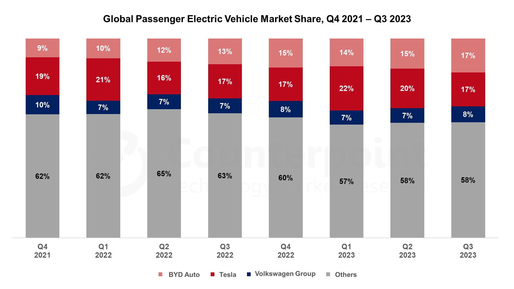
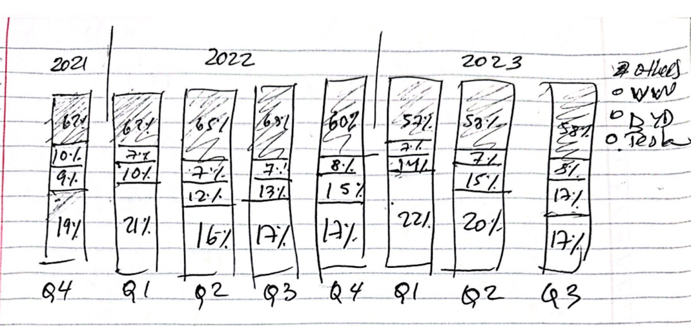
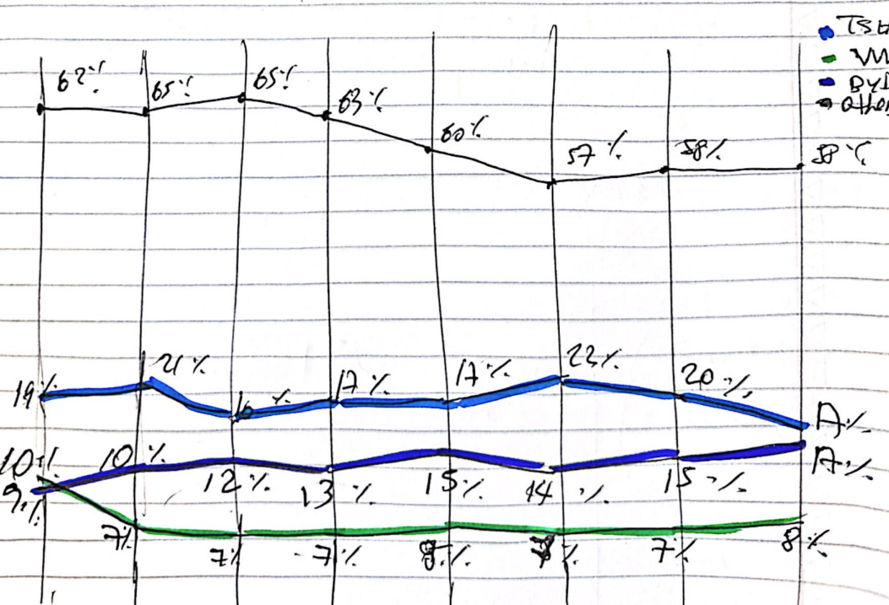

| [home page](https://cmustudent.github.io/tswd-portfolio-templates/) | [visualizing debt](visualizing-government-debt) | [critique by design](critique-by-design) | [final project I](final-project-part-one) | [final project II](final-project-part-two) | [final project III](final-project-part-three) |

# Critique by Design with Tableau (MakeoverMonday)

**Step one: choose a data visualization from MakeoverMonday**

I selected the "Global Electric Vehicle Market Share" visualization from the https://makeovermonday.co.uk/ website, created by Counterpoint Research on February 13, 2023. I chose this because the electric vehicle (EV) market is garnering public interest due to its environmental impact and the disruptive innovations it brings. Additionally, upon viewing the graph, I immediately saw how it could be improved. I struggled to understand it at first glance, something that could have been mitigated with a better design.

**Step two: critique the data visualization**

Below is the graph on which I will be sharing my observations:

<u>Overall Observations About the Data Visualization</u>

<u>The first thing that caught my attention:</u>
The first thing that caught my attention about the visualization was the colors they chose. At first, I didn't understand why they had chosen two shades of red and then blue, but after a few minutes, I realized that they used these colors in reference to the predominant color in the logos of these companies: Tesla, BYD, and Volkswagen.
Another thing that caught my attention was the fact that, due to the nature of the chart and how the information was presented, the article aims to show the evolution of the Market Share for each quarter of the 3 main companies that manufacture EVs; however, the "Others" section in the chart is placed at the bottom, which makes comparison difficult since the bottom part of the chart always helps to take it as a point of reference to then easily evaluate whether the proportions are improving or not. Therefore, you place the key element at the bottom, not the “others” element. Another thing that caught my attention was that Tesla was in the center of the chart and not in the bottom section, being the brand with the highest volume in the first quarter.

<u>Changes I suggest:</u>
If keeping the style of the bar chart, I would change the chosen colors to others that are simpler to visualize, such as #05668D for Tesla, #00A896 for BYD, and #A6A6A6 for "Others". During my exploration of Tableau, I realized that I couldn’t pick this colors, so I ended up picking other set of colors that I found aesthetic too. In addition, I would change the distribution of the presented brands, placing Tesla at the bottom, followed by VW, followed by BYD, followed by Others. The criteria for this order would be ascending, starting with Tesla since it has the highest market share percentage in Q42021.
Another change I would make would be to remove the table shown below the chart. It doesn't make sense to present the same information twice if it doesn't add more value.
Something else I did not see in the visualization was the market value; just showing percentages over a total of 100% doesn't tell us if the market is growing or if it is getting smaller. I consider this information to be key, especially if the audience wants to make marketing, research or financial decisions as a result of this visualization. However, when I jumped into the data link, I couldn’t see that information available. Therefore, I was unable to incorporate it on my final proposal.
Another thing I observed and did not like was the location of the legend; having it at the bottom, with important data above, made my eye move up and down several times to understand what I was observing.
I also noticed that the title was not representative and could be improved. Instead of "Global Passenger Electric Vehicle Market Share, Q4 2021 - Q3 2023," a better way to tell a story and not just be descriptive could have been: "Global Market Share Trends in Electric Passenger Vehicles from Q4 2021 to Q3 2023." This provides a better representation of what is being shown—a trend, not something static.
Also, instead of repeating the years (e.g., 2021, 2022, 2023) for every quarter, it could be simplified by showing a single year and then labeling every quarter. This would create a cleaner visualization.
If choosing to completely change the chart, I would opt for a trend line to compare the evolution of the different brands, and at the end of the trend, on the right edge of the lines, I would place the logo of each brand, thus eliminating the need for a legend with the brands below the chart. However, I am not sure if I will be able to do this edition in Tableu (the logo insertion).

<u>What I did like about the chart:</u>

Something I did like about the chart was that it did not make excessive use of outlines or lines in the charts, it just presented the colors, and the percentages could be clearly visualized. Also, the space between the bars seemed clear and aesthetic.

Therefore, I rated the chart in the following way:

<u>Completeness:</u> 6

While the visualization includes essential data on market share percentages, it lacks completeness due to the absence of market growth data and a clear context for the percentages. It seems it was the only data available for the developer of this viz.

<u>Perceptibility:</u> 6

The visualization's use of color and the distribution of data points make it relatively easy for the reader to understand the market share information at a glance. However, placing the "Others" category at the bottom makes analyzing the EV companies we want to focus on more challenging. A trend line would provide a clearer, more intuitive comparison over time. Additionally, having the legend at the bottom causes the reader's eye to move up and down frequently.

<u>Truthfulness:</u> 7

The data is presented accurately and reliably. However, the lack of context regarding the total market size and growth may lead to a somewhat incomplete representation of the market dynamics.

<u>Intuitiveness:</u> 6

The chart is somewhat intuitive, with colors representing different companies based on their brand’s colors and clear labeling.

<u>Effectiveness of the Visualization in Reaching Its Audience</u>

The audience can be quite diverse, ranging from financial analysts and market researchers to consultants and students. I believe the information is presented in a positive manner, but there is considerable room for improvement. For example, for any of the audiences described above, showing only the market share percentages might be somewhat limited information. Displaying percentages alone is not always sufficient; it's always beneficial to provide a reference point to understand whether 10% of 100 is truly better than 50% of 10. However, I know that this information was unavailable. The visualization is aesthetically pleasing because it follows visualization principles such as maintaining a gray color for the “others” section and incorporating only three of the main brands with different colors. However, there is still room for improvement in the use of colors and their distribution. Even the choice of chart style can be improved because if the goal is to show evolution, a trend line might convey a more powerful message. In conclusion, I feel the visualization is effective but I would give it a medium, not excellent, score.

Therefore, I rated the chart in the following way:

<u>Aesthetics:</u> 5

The viz does not make excessive use of outlines or lines and presents the information in a clean manner, however, there's significant room for improvement in color choice and distribution. The visualization is aesthetically pleasing because it follows visualization principles such as maintaining a gray color for the “others” section and incorporating only three of the main brands with different colors. However, there is still room for improvement in the use of colors and their distribution. Even the choice of chart style can be improved because if the goal is to show evolution, a trend line might convey a more powerful message.

<u>Usefulness:</u> 6

The visualization is useful for its intended audience, which includes financial analysts, market researchers, consultants, and students. However, the lack of market value context limits its usefulness, as it does not provide a complete picture of the market size or growth, which is crucial for making informed decisions. When I jumped into the data source, I saw that information was not available, so I couldn't use it either in my proposed graph idea.

<u>Engagement:</u> 5

The visualization's current state might not fully engage the audience, as it lacks compelling context and interactive elements that could encourage further exploration or discussion of the data.

<u>Final thoughts</u>

The questions helped me focus objectively on the main components to analyze and reflect on whether it is truly doing a good job of overall communication. I was able to evaluate the selection of the chart, colors, distribution, audience, and style. I have already shared my recommendations in the previous questions. However, something I would add is that on the web, below the chart, there are highlights that do not derive from the visualization. For example, the first highlight states: "Global BEV sales grew 29% YoY in Q3 2023", yet we have no way of knowing that from the visualization, since it only shows the percentages of how the brands' shares were distributed within the 100% of that quarter. As a final thought I want to share that I have two different visualizations in mind to improve this, once is a better version of the stacked bar graph, and the other is a trend line.

**Step three: sketch out a solution**

I do believe that the original stacked bar chart could be significantly improved. Additionally, considering that multiple quarters were shown over a timeline, presenting the data in a trend line could also have been impactful. Therefore, I decided to sketch these two possible variations: a stacked bar chart and a trend line. I applied all the ideas that came to me during step 2 after examining the original graph and the context of the webpage for several minutes.

<u>This is the sketch of the stacked bar chart:</u>

So, here I retained the original graph idea but with modifications: I inverted the distribution, placing "Others" at the top and "Tesla" at the bottom, followed by BYD, then VW. I also experimented with a different approach to presenting the quarters, instead of just showing the complete year and quarter information below. Additionally, I believe that placing the legend on the right, instead of keeping it below, could enhance the visualization.

<u>This is the sketch of the trend line graph:</u>

Here, I experimented with a completely different approach to effectively show the trend quarter by quarter and give the audience a better sense of what is happening. In the stacked bar chart, it still requires some effort (and time) to visualize which brand is gaining market share and which one is not. I also maintained the idea of placing the legend on the right.

**Step four: Test the solution**

I presented my sketches (in-person) to two different students in their mid-20s and asked them the following questions: Can you tell me what you think this is?, Can you describe to me what this is telling you?, Is there anything you find surprising or confusing?, Who do you think is the intended audience for this?, Is there anything you would change or do differently?

After presenting both sketches, I realized that I had forgotten to incorporate a title in my sketches (both of them). Since the two students pointed that out in the first question: " Can you tell me what you think this is?" Therefore, they didn't know exactly what I was trying to show at first. However, because the legend included car names, they could sort of figure it out. This "error" gave me the opportunity to actually realize that the original title of the graph was not ideal as it didn't show what was really happening. It said: "Global Passenger Electric Vehicle Market Share, Q4 2021 - Q3 2023," which could give the impression that it is something static, when it is not. So, I incorporated the word "trend" in my title and suggested some changes: "Global Market Share Trends in Electric Passenger Vehicles from Q4 2021 to Q3 2023."

Regarding the question, "Can you describe to me what this is telling you?" they both explained my intention for both graphs very well. In response to "Is there anything you find surprising or confusing?" we discussed the use of car brand colors. One student mentioned it was better not to use them since two car brands had red-like color logos: "Tesla" and "BYD", suggesting it would be better to use other colors for clearer differentiation. On the trend line graph, one student disliked the vertical lines identifying each quarter and suggested their removal. I decided to follow this advice. The other student recommended placing the legend at the bottom; however, I opted to keep the legend on the right, finding it more aligned with the natural eye movement from top left to top right.

When asked, "Who do you think is the intended audience for this?" they identified "Investors" or "Market Researchers" as key audiences.

Finally, concerning "Is there anything you would change or do differently?" one student felt it was presented well as is, while another suggested adding the actual car logos into the graph as a background.

With these valuable inputs, I jumped into Tableau to build the two graphs.

**Step five: Build your solution**

<u>This is the new stacked bar chart version:</u>

<noscript></noscript><object class='tableauViz'  style='display:none;'><param name='host_url' value='https%3A%2F%2Fpublic.tableau.com%2F' /> <param name='embed_code_version' value='3' /> <param name='site_root' value='' /><param name='name' value='EVs_StackedBar&#47;Sheet1' /><param name='tabs' value='no' /><param name='toolbar' value='yes' /><param name='static_image' value='https:&#47;&#47;public.tableau.com&#47;static&#47;images&#47;EV&#47;EVs_StackedBar&#47;Sheet1&#47;1.png' /> <param name='animate_transition' value='yes' /><param name='display_static_image' value='yes' /><param name='display_spinner' value='yes' /><param name='display_overlay' value='yes' /><param name='display_count' value='yes' /><param name='language' value='en-US' /><param name='filter' value='publish=yes' /></object>

<u>This is the new trend line graph version:</u>

<noscript></noscript><object class='tableauViz'  style='display:none;'><param name='host_url' value='https%3A%2F%2Fpublic.tableau.com%2F' /> <param name='embed_code_version' value='3' /> <param name='site_root' value='' /><param name='name' value='EVs_Trend&#47;Sheet12' /><param name='tabs' value='no' /><param name='toolbar' value='yes' /><param name='static_image' value='https:&#47;&#47;public.tableau.com&#47;static&#47;images&#47;EV&#47;EVs_Trend&#47;Sheet12&#47;1.png' /> <param name='animate_transition' value='yes' /><param name='display_static_image' value='yes' /><param name='display_spinner' value='yes' /><param name='display_overlay' value='yes' /><param name='display_count' value='yes' /><param name='language' value='en-US' /><param name='filter' value='publish=yes' /></object>

