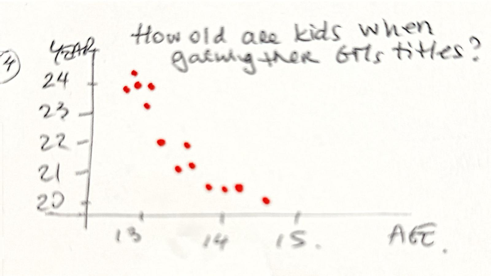

| [home page](https://cmustudent.github.io/tswd-portfolio-templates/) | [visualizing debt](visualizing-government-debt) | [critique by design](critique-by-design) | [final project I](final-project-part-one) | [final project II](final-project-part-two) | [final project III](final-project-part-three) |

# Outline
- **Introduction: The Evolution of Chess as a Competitive Sport**  
  Just like any other sport, Chess is continuously evolving. Similar to how records in the 100-meter dash are broken almost every Olympics, chess experiences its own form of progress with ELO rankings reaching new heights over time.  
  (Visual: Show ELO ratings evolution)

- **Increasing Popularity**  
  Chess is also becoming increasingly popular, as evidenced by the following trends.  
  (Visual: Show the number of GMs per year)  
  (Visual: Show the subscription growth of chess YouTubers)

- **The Impact of Technology on Chess**  
  Technology has significantly altered the landscape of chess. AI has achieved levels of play that are extremely challenging for humans to match, as illustrated in the following ELO comparison.  
  (Visual: Show ELO averages between GMs and machines in the last 10 years)

- **The Rise of Young Prodigies**  
  With easier access to technology, the game is not just changing; it's also facilitating the emergence of new, young prodigies.  
  (Visual: Show the number of GMs by the age at which they obtained the title, e.g., 13 yo, 14 yo, 15 yo, etc.)

- **Conclusion: Embracing Technology**  
  It's enlightening to observe how new generations are leveraging technology to enhance their gameplay. Instead of viewing technology as a foe, embracing it as a tool can elevate your game to new heights.

- **Story Arc**

## Initial sketches

- **Introduction: The Evolution of Chess as a Competitive Sport**
  
Visualization depicting the evolution of the competitive landscape, illustrating the improvement in ELO ratings (currently, the world champion boasts a peak ELO rating of approximately 2830, previous WRs has ELOs around 2700s)

- **Increasing Popularity**
Visualization illustrating the growing interest in chess, evidenced by an increasing number of Grandmasters worldwide each year and a surge in followers of chess-related video streaming on YouTube. Additionally, my storytelling could highlight how pandemic lockdowns across various countries have contributed to a rise in chess participation.

- **The Impact of Technology on Chess**
Visualization demonstrating how AI-powered chess engines, like Stockfish, achieve unprecedented ELO ratings due to the precision of their gameplay, and comparing these with the peak human ELO to underscore the significant difference for my audience.

- **The Rise of Young Prodigies**
Illustrate how, annually, an increasing number of children attain Grandmaster status, underscoring the pivotal role of technology in improving educational and training environments.

# The data
I've been exploring sources for obtaining data and have come across some datasets on the Kaggle page, as shown here:

https://www.kaggle.com/datasets/aryaman1a/top-chess-players-in-the-world
https://www.kaggle.com/code/arindambaruah/who-is-dominating-women-s-chess/input
https://www.kaggle.com/datasets/rishabh6377/worlds-chess-grandmasters-data

I plan to upload the data into Tableau to experiment with it and determine the best visualization options for the story I intend to tell. I will include the source of my information below each graph. Additionally, I've found some copyright-free images on Pexels that could enhance my storytelling, such as the following image: 
https://www.pexels.com/photo/white-chess-piece-on-top-of-chess-board-814133/

I plan to incorporate these types of images to enrich the narrative.

# Method and medium
I plan to use Tableau and ArcGIS Story Maps to tell my story. Although I still need to research how to use these tools effectively, I am confident that I will be able to create compelling storytelling and make a significant impact on my audience.
